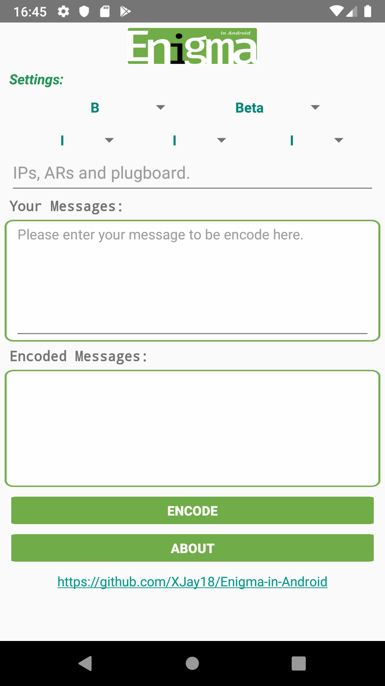
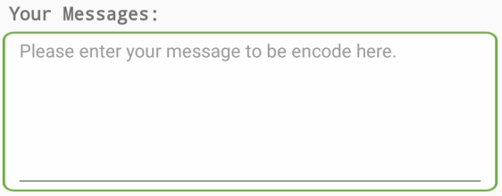
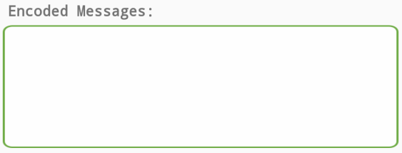

# Enigma-in-Android

This is an Android Enigma Simulator.

# Screen shot

# How to use
1. First, setting the five rotors here.

1. Then, you can give the initial position of the last four rotors in the format of `[A-Z]{4}` (e.g. `AAAA`, `AYCI`, etc) in this line. 

If you don't want to set these things, you can simply ignore the line.
1. After all settings done, you can type your messages in this frame.

1. Press `ENCODE`. Then the encoded messages will be shown here.

Note that you can press the encoded messages to copy them into your clipboard.

# Notice
This is one of the project of CS61b @ UCB, Fall 2019. 
I modify the original java project and set up this Android project for coding practice.
If you find this useful or interesting, please :star2: ~
